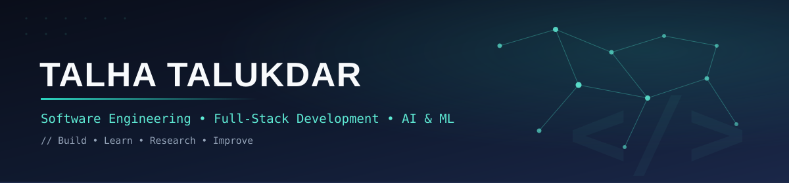

<div align="center">



<br/><br/>

<sub>Hi, I'm</sub>

<h1><strong>TALHA TALUKDAR</strong></h1>


<br/><br/>

[](https://github.com/talhatalukdar)
[](https://www.linkedin.com/in/talha-talukdar-070193291)
[](mailto:talha76551@gmail.com)

<br/>


</div>

<br/>
```


## About Me

I'm a Computer Science student at **American International University-Bangladesh (AIUB)**, majoring in Software Engineering with an academic focus on Advanced Database Management and Machine Learning.

I enjoy building software end-to-end — from designing database schemas and REST APIs to developing responsive frontend interfaces. Alongside software development, I have an academic interest in Machine Learning, NLP, speech processing, and explainable AI.

I'm currently preparing for **Software Engineering and Full-Stack Development internships**, while continuing to strengthen my backend, database, and system design fundamentals.

### Currently

- Building full-stack applications using the MERN ecosystem
- Improving backend development and REST API design skills
- Working on academic research involving ML, NLP, speech, and explainable AI
- Strengthening database design, SQL, and backend fundamentals
- Learning Docker, CI/CD, cloud fundamentals, and system design

---

## Technical Skills

### Programming Languages

<p align="center">

</p>

### Frontend Development

<p align="center">

</p>

### Backend Development

<p align="center">

</p>

<p align="center">
REST APIs · Authentication · Server-side Development · API Integration
</p>

### Database

<p align="center">


</p>

<p align="center">
SQL · PL/SQL · Database Design · ER Modeling · Normalization · Procedures · Triggers · Views
</p>

### AI / Machine Learning

<p align="center">

</p>

<p align="center">
Machine Learning · Deep Learning · NLP · Speech Processing · CNN · BERT · Multimodal Learning · SHAP · LIME
</p>

### Tools

<p align="center">

</p>

---

## Currently Learning

<p align="center">

</p>

Currently building foundations in:

- Docker and containerized development
- CI/CD pipelines and deployment workflows
- AWS and Azure cloud fundamentals
- Software architecture and system design
- Production-oriented backend development

> These technologies are currently part of my learning path; I do not claim production-level experience with them yet.

---

## Research & Academic Work

### Multimodal Speech-Text Analysis with Explainable AI for Depression Screening

Academic ML research exploring depression screening using multimodal speech and text information from the **E-DAIC dataset**.

The approach combines audio features such as MFCCs with a 1D CNN encoder and text representations from BERT, followed by attention-based multimodal fusion and classical machine-learning classifiers.

The study also explores class-imbalance handling with SMOTE and model interpretation using SHAP and LIME, alongside statistical evaluation techniques including bootstrap confidence intervals and McNemar's test.

> This is an academic research study and not a diagnostic or clinical system.

### A Digital Marketplace Framework for Carbon-Credit Awareness and Participation Among Smallholder Farmers in Bangladesh

A research framework investigating how a digital marketplace could improve carbon-credit awareness and participation among smallholder farmers.

The proposed framework covers:

- Awareness and education
- Carbon-credit estimation
- Buyer connection
- Verification
- Transparent payment
- Support from trusted intermediaries

The study is grounded in literature review and qualitative field research.

### IoT and Machine Learning-Based Smart Irrigation System with Autonomous and Manual Control for Cost-Effective Precision Agriculture in Bangladesh

Research exploring an IoT-based irrigation framework that combines environmental sensor data with machine-learning-based prediction to support automated irrigation decisions while maintaining manual farmer control.

The proposed system focuses on affordable precision agriculture and efficient water usage in the Bangladeshi farming context.

---

## Selected Academic Projects

### Greedy Knights
*C# · Windows Forms · Object-Oriented Programming*

A 2D strategy game developed as a C# course project.

- AI-controlled opponents and multiplayer gameplay
- Coin and reward collection
- Real-time scoring system
- Event-driven game logic
- Object-oriented architecture for game entities

### Hotel Management System
*Java · Object-Oriented Programming*

A Java-based application designed to manage core hotel operations.

- Room booking and reservation management
- Check-in and check-out handling
- Room availability tracking
- Guest record management
- Billing and invoice logic

### Brick Breaker Game
*C++ · OpenGL · Computer Graphics*

A classic arcade-style game developed to practice 2D graphics programming.

- Real-time paddle and ball movement
- Collision detection
- Brick rendering and destruction
- Score and level progression
- Frame-based OpenGL rendering

### Metro Rail Management System
*Oracle · SQL · PL/SQL · Database Systems*

A database engineering project for managing a metro rail operation.

- ER modeling and database design
- Relational schema normalization
- SQL and PL/SQL business logic
- Procedures and triggers
- Views and reporting queries
- Web-based interface for database interaction

### Coaching Center Management System
*Database Management · SQL*

A relational database system for managing coaching-center operations.

- Student management
- Teacher and course management
- Payment tracking
- Attendance management
- Examination records
- Normalized database design

---

## Full-Stack Development

I build full-stack web applications with a focus on clean architecture, maintainable code, and practical user experiences.

My current development stack includes:

**Frontend**

React · Next.js · TypeScript · JavaScript · Tailwind CSS

**Backend**

Node.js · Express.js · REST APIs

**Database**

MongoDB · MySQL · Oracle · SQL · PL/SQL

Typical areas I work with include:

- Authentication and authorization
- REST API development
- CRUD operations
- Database integration
- Dashboard interfaces
- Form handling and validation
- Responsive UI development
- API testing with Postman

---

## GitHub Analytics

<div align="center">


<br/><br/>


</div>

<br/>

> GitHub's native contribution graph is the primary source of truth for activity. These widgets are supplementary.

---

## Current Goals

- Build and deploy production-quality full-stack applications
- Strengthen backend engineering and database fundamentals
- Improve system design and software architecture knowledge
- Learn Docker, CI/CD, and cloud deployment
- Complete and publish ongoing ML/NLP research
- Secure a Software Engineering / Full-Stack Development internship

---

## Let's Connect

I'm open to:

- Software Engineering internships
- Full-Stack Development opportunities
- Backend development opportunities
- Research collaboration
- Technical projects and collaboration

<div align="center">

**Feel free to reach out.**

<br/>

[](https://github.com/talhatalukdar)
[](https://www.linkedin.com/in/talha-talukdar-070193291)
[](mailto:talha76551@gmail.com)

<br/><br/>


</div>
